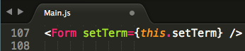

# NYT-React

#### A React-based rendition of the New York Times Article Search application. The app utilizes Node, Express and MongoDB so that users can save articles to read later.

##Program Information

###Main.js - Parent


####Passes to components (CHILDREN)...

####**Component 1: Form -> setTerm function** 



####**Component 2: Results -> var address** 


####**Component 3: History -> var history** 


###Component 1: Form.js

User inputs a location.


Takes the input value and sets it to **this.state.term**
Then runs **handleChange** which sets the state to the inputted term.


Runs handleSubmit function.


Takes the **setTerm function** from PARENT and passes it **this.state.term** from the CHILD


Main.js **searchTerm** is now the inputted term.


###Parent: Main.js 
runs **componentDidUpdate**
runs **helpers.runQuery**

Searches for articles in **Helpers.js**
returns **_data_** to **Main.js**
Main.js saves search results into **this.setState** **_results_**


**Main.js** runs postHistory

Which uses **helpers.js** to post 


###Helpers.js
###Results.js

#####**File Structure**
```
NYT-React
|
+ -- app
|   | -- app.js
|   |
|   + -- components
|   |   + -- Children
|   |   |   | -- saved.js
|   |   |   | -- search.js
|   |   |
|   |   | -- Main.js
|   |
|   + -- config 
|       | -- routes.js
|
+ -- models
|   | -- schema.js
|   
| -- server.js
+ -- views
|   | -- 
|
|
|
```
